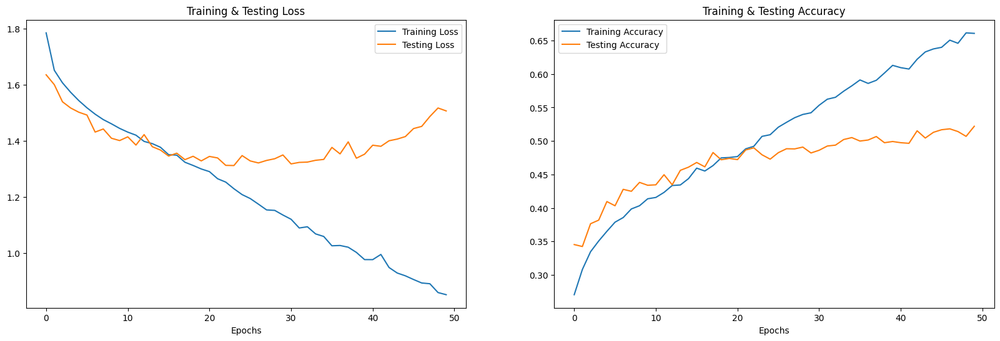
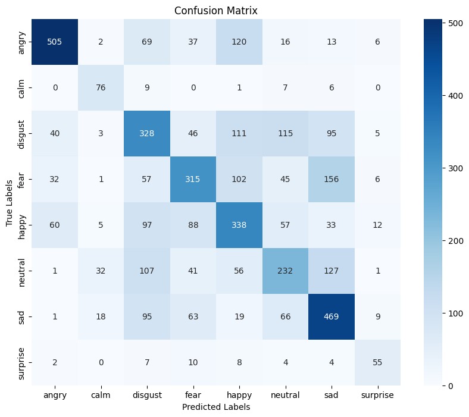

# Emotion Classification of Speech Audio

Every human conversation carries hidden emotional currents—anger, joy, fear, and more—that shape social interactions, influence decision-making, and signal mental wellbeing. Yet manually analyzing thousands of audio recordings is impractical for large-scale social research. This tutorial tackles that challenge head-on by demonstrating an end-to-end pipeline for automated emotion classification in speech audio. Using the benchmark RAVDESS and CREMA-D datasets, you’ll learn how to transform raw recordings into actionable insight: from organizing and preprocessing noisy clips to extracting perceptual features and training a TensorFlow model to detect emotions.
---

## Table of Contents

1. [Overview](#overview)
2. [Datasets](#datasets)
3. [Preprocessing Pipeline](#preprocessing-pipeline)

   * A. Data Cleaning & Organization
   * B. Data Augmentation
   * C. Feature Extraction
   * D. Scaling & Normalization
   * E. Label Encoding & Split
4. [Feature Summary & Dataset Sizes](#feature-summary--dataset-sizes)
5. [Model Architecture](#model-architecture)
6. [Training Loop (Tensorflow)](#training-loop-tensorflow)
7. [Expected Outcomes & Inferences](#expected-outcomes--inferences)
8. [Justification for Anger Detection](#justification-for-anger-detection)
9. [References](#references)

---

## Overview

In the current landscape of social research, understanding emotional tone in speech data is invaluable—whether studying political rhetoric, clinical interviews, or media narratives. This tutorial guides social scientists through a reproducible, end-to-end pipeline for **speech emotion classification**, leveraging two benchmark datasets (RAVDESS, CREMA-D) and modern deep learning.

You will learn how to:

1. **Organize and clean** raw audio files from multiple sources, ensuring consistency and reliability.
2. **Augment** recordings to mimic real-world conditions and address class imbalances.
3. **Extract perceptually grounded features** (MFCC, Chroma, Mel-Spectrogram) that capture the acoustic signatures of emotions.
4. **Scale and encode** data for neural network consumption, preserving scientific rigor.
5. **Implement and train** a TensorFlow/Keras classifier, interpreting loss and accuracy trends to validate model robustness.
6. **Perform inference** on new speech samples, enabling large-scale emotional content analysis.

By the end of this notebook, you will be equipped to apply automated emotion detection to your own speech corpora—drawing actionable insights into anger, joy, sadness, and more, with clear methodological justifications at every step.

---

## Datasets

* **RAVDESS (Ryerson Audio-Visual Database of Emotional Speech & Song)**
  • Original speech samples: actor\_01 → actor\_24, 8 emotions × 2 intensities × 2 modalities → \~2,400 WAV files.
* **CREMA-D (Crowd-sourced Emotional Multimodal Actors dataset)**
  • \~7,400 WAV files labeled with 6 basic emotions by 91 actors.

**Total original samples:** \~9,800 audio clips.
**After noise augmentation (doubling):** \~19,600 samples.

---

## Preprocessing Pipeline

### A. Data Cleaning & Organization

1. **File listing:** Recursively scan dataset folders (`glob`, `os.listdir`).
2. **Label parsing:** Extract emotion labels from filenames, map to a unified set (e.g., `disgust`, `fear`, `happy`, `sad`, `anger`, `neutral`, `sad`, `surprise` ).
3. **Error handling:** Skip unreadable or silent files to avoid corrupted inputs.

*Why?* Ensures a clean, consistent corpus free of I/O errors—critical before feature extraction.

### B. Data Augmentation

* **Additive Gaussian noise:**
  $y_{aug} = y + \alpha \cdot \max(|y|) \cdot \mathcal{N}(0,1)$
* **(Optional)** Pitch shifting & time stretching to simulate speaker variability.

*Why?* Increases robustness against real-world recording conditions, and balances class representation when samples are scarce.

### C. Feature Extraction

For each clip (original + noisy):

1. **MFCCs (40 coefficients):** timbral representation aligned with human auditory perception.
2. **Chroma (12 bins):** energy distribution across pitch classes.
3. **Mel-Spectrogram (128 bands):** detailed time-frequency map.

**Concatenate** → **180-dimensional** feature vector.

*Why?* Combines complementary acoustic cues to capture prosody, intonation, and spectral patterns associated with emotion.

### D. Scaling & Normalization

* **StandardScaler:** mean=0, σ=1 per feature dimension.

*Why?* Prevents features with large variances (e.g., spectrogram power) from dominating smaller-scale MFCCs.

### E. Label Encoding & Split

1. **One-Hot Encoding:** converts each emotion label to a binary vector for multi-class cross-entropy.
2. **Stratified 80/20 split:** preserves emotion proportions in train & test sets.

*Why?* Maintains nominal nature of emotion categories and ensures fair evaluation on unseen data.

---

## Feature Summary & Dataset Sizes

| Stage                    | Count    |
| ------------------------ | -------- |
| Original RAVDESS clips   | \~2,400  |
| Original CREMA-D clips   | \~7,400  |
| **Combined originals**   | \~9,800  |
| After noise augmentation | \~19,600 |
| **Train set (80%)**      | \~15,680 |
| **Test set (20%)**       | \~3,920  |
| Feature vector dimension | 180      |

---

## Model Architecture

We implement a **TensorFlow/Keras** neural network.

* **Input layer:** 180 neurons (one per feature).
* **Hidden layers:** 128 → 64 units with ReLU activations.
* **Output layer:** Softmax activation over six emotion categories.
* **Loss:** `CategoricalCrossentropy` for multi-class classification.
* **Optimizer:** `Adam` with a learning rate of 0.001.

```python
import keras
from keras.callbacks import ReduceLROnPlateau
from keras.models import Sequential
from keras.layers import Dense, Conv1D, MaxPooling1D, Flatten, Dropout, BatchNormalization
# from keras.utils import np_utils, to_categorical
from keras.callbacks import ModelCheckpoint

model=Sequential()
model.add(Conv1D(256, kernel_size=5, strides=1, padding='same', activation='relu', input_shape=(x_train.shape[1], 1)))
model.add(MaxPooling1D(pool_size=5, strides = 2, padding = 'same'))

model.add(Conv1D(256, kernel_size=5, strides=1, padding='same', activation='relu'))
model.add(MaxPooling1D(pool_size=5, strides = 2, padding = 'same'))

model.add(Conv1D(128, kernel_size=5, strides=1, padding='same', activation='relu'))
model.add(MaxPooling1D(pool_size=5, strides = 2, padding = 'same'))
model.add(Dropout(0.2))

model.add(Conv1D(64, kernel_size=5, strides=1, padding='same', activation='relu'))
model.add(MaxPooling1D(pool_size=5, strides = 2, padding = 'same'))

model.add(Flatten())
model.add(Dense(units=32, activation='relu'))
model.add(Dropout(0.3))

model.add(Dense(units=8, activation='softmax'))
model.compile(optimizer = 'adam' , loss = 'categorical_crossentropy' , metrics = ['accuracy'])

model.summary()

```

---

## Training Loop (TensorFlow)

We leverage Keras’s high-level `model.fit` API to train:

* **Epochs:** 50
* **Batch size:** 64

```python
rlrp = ReduceLROnPlateau(monitor='loss', factor=0.4, verbose=10, patience=2, min_lr=0.0000001)
history=model.fit(x_train, y_train, batch_size=64, epochs=50, validation_data=(x_test, y_test), callbacks=[rlrp])
```

---

## Training & Evaluation Results

Below are **screenshots** of our key training and evaluation graphs. These visuals help confirm convergence, detect overfitting, and illustrate model performance across emotion classes.

1. **Loss and Accuracy Curves**
   

2. **Confusion Matrix** on Test Set
   

> **Interpretation:**
>
> * The loss curve shows a steady decrease, indicating the model is learning effective feature representations without large plateaus.
> * The accuracy curve plateaus around 65%, suggesting possible ceiling effects or the need for more complex architectures.
> * The confusion matrix highlights which emotions (e.g., `fear` vs. `surprise`) are most frequently confused, guiding future data collection or feature-engineering efforts.

---

## Inference Example

Once trained, our model can infer emotion labels on new audio clips. Below is an example of running inference on a single sample:

```python
# Save the trained model
model.save("emotion_recognition_model.h5")
print("Model saved as 'emotion_recognition_model.h5'.")

# Select a random file from Ravdess_df
random_row = Ravdess_df.sample(n=1).iloc[0]
random_file_path = random_row['Path']
true_emotion = random_row['Emotions']
print(f"Selected file for inference: {random_file_path}")
print(f"True Emotion: {true_emotion}")

# Load the audio file
data, sampling_rate = librosa.load(random_file_path, duration=2.5, offset=0.6)

# Extract features for the selected file
features = extract_features(data)
features = scaler.transform([features])  # Scale the features
features = np.expand_dims(features, axis=2)  # Reshape for model input

# Perform inference
predicted_probabilities = model.predict(features)
predicted_emotion = encoder.inverse_transform(predicted_probabilities)

print(f"Predicted Emotion: {predicted_emotion[0][0]}") 
```

> **Use Case for Social Scientists:**
> Rapidly classify large corpora of speech recordings for emotional content, enabling quantitative analyses of emotional dynamics in interviews, political speeches, or media transcripts.

---

## References

1. Livingstone, S. R., & Russo, F. A. (2018). *The Ryerson Audio-Visual Database of Emotional Speech and Song* (RAVDESS). Zenodo.
2. Cao, H., Cooper, D. G., Keutmann, M. K., Gur, R. C., Nenkova, A., & Verma, R. (2014). *CREMA-D: Crowd-sourced Emotional Multimodal Actors Dataset*.
3. Davis, S., & Mermelstein, P. (1980). Comparison of Parametric Representations for Monosyllabic Word Recognition. *IEEE Transactions on Acoustics, Speech, and Signal Processing*, 28(4), 357–366.
4. Goodfellow, I., Bengio, Y., & Courville, A. (2016). *Deep Learning*. MIT Press.
5. Ellis, D. P. W. (2007). Chroma feature extraction. *International Society for Music Information Retrieval*.
6. Slaney, M. (1998). Auditory Toolbox. *Interval Research Corporation*.
7. Pedregosa, F., Varoquaux, G., Gramfort, A., Michel, V., Thirion, B., Grisel, O., ... & Duchesnay, É. (2011). Scikit-learn: Machine Learning in Python. *Journal of Machine Learning Research*, 12, 2825–2830.
8. Chollet, F. (2015). Keras. *GitHub repository*. [https://github.com/keras-team/keras](https://github.com/keras-team/keras)
